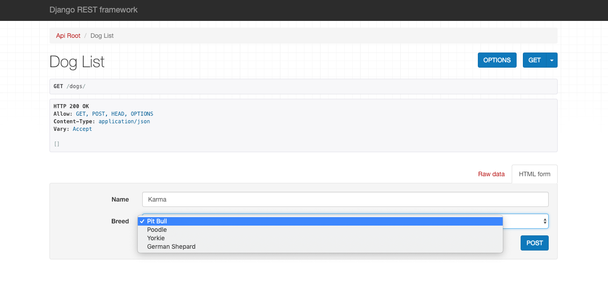

# Getting Started With Django Rest Framework

###	Description

###	Requirements
Pip
Python
Django

### Install Django Rest Framework
	pip install djangorestframework

### Start Django Project
	django-admin startproject dogs_api

### Go Into Project Directory
	cd dogs_api

### Migrate Existing Models
	python manage.py migrate

### Create The App
	python manage.py startapp dogs

### Create Files For URL's and Serializers

First we need to make files for the serializers and urls. From your command line go into the dogs directory.

	cd dogs

Create the serializers file and the urls file.

	touch serializers.py urls.py

### Open In Text Editor
To open in VS Code type the following in your command line.

	code .

### Add Apps to Installed Apps in Project Settings
In dogs_api/settings.py scroll down until you see the following code

	INSTALLED_APPS = [
    	'django.contrib.admin',
    	'django.contrib.auth',
    	'django.contrib.contenttypes',
    	'django.contrib.sessions',
    	'django.contrib.messages',
    	'django.contrib.staticfiles',
	]

Now add rest_framework and your apps with the following code. Be sure to add a comma between apps

	'rest_framework',
	'dogs'

The Installed Apps should now look like this

	INSTALLED_APPS = [
    	'django.contrib.admin',
    	'django.contrib.auth',
    	'django.contrib.contenttypes',
    	'django.contrib.sessions',
    	'django.contrib.messages',
    	'django.contrib.staticfiles',
		'rest_framework',
		'dogs'
	]

### Edit URLS In Project
In dogs_api/urls.py, you'll see the following code.

	from django.contrib import admin
	from django.urls import path

	urlpatterns = [
    	path('admin/', admin.site.urls),
	]

Now we need to include our path and import include from django.urls. We're already importing django.urls so we can just add a comma after path.

	from django.urls import include	path, include

Now add the following path to the urls. Be sure to add a comma between paths.

	path('', include('dogs.urls'))

Now your dogs_api/urls.py file should now contain the following code.

	from django.contrib import admin
	from django.urls import path, include

	urlpatterns = [
    	path('admin/', admin.site.urls),
		path('', include('dogs.urls'))
	]

### Create A Model
In the directory dogs/models.py, you'll see

	from django.db import models

Create a model for Breed. The dogs/models.py should now contain the following code.

	from django.db import models

	class Breed(models.Model):
		name = models.CharField(max_length=100)

		def __str__(self):
			return self.name

### Create A Serializer For Your Model

Now we need to import serializers, our model, and create a class serlializer from our model. In your text editor,copy the following code to your dog/serializer.py file.

	from rest_framework import serializers
	from .models import Breed

	class BreedSerializer(serializers.HyperlinkedModelSerializer):
		class Meta:
			model = Breed
			fields = ('id', 'url', 'name')

### Create A View For Model
We're using viewsets for this example so we need to import viewsets along with our model and serializer, and then create our the view. In the directory dogs/views.py, you'll see the following code.

	from django.shortcuts import render

Copy the following code beneath

	from rest_framework import viewsets
	from .models import Breed
	from .serializers import BreedSerializer

	class BreedView(viewsets.ModelViewSet):
    	queryset = Breed.objects.all()
    	serializer_class = BreedSerializer

### Create A URL And Router For The View

Now we need to import our views, routers, path, and include.
In your text editor, go to dogs/urls.py and copy the following code.

	from django.urls import path, include
	from . import views
	from rest_framework import routers

	router = routers.DefaultRouter()
	router.register('breeds', views.BreedView)

	urlpatterns = [
    	path('', include(router.urls))
	]

### Make Migrations And Migrate Models
From the command line, in the root directory copy the following code to make migrations with the model.

	python manage.py makemigrations

Now migrate the model.

	python manage.py migrate

### Run The Server
From the command line, type the following code to run the server

	python manage.py runserver

The server should now be running on port http://127.0.0.1:8000/. Click on the link and your Django Rest API should be up and running.

### Add Breeds

At the root of your api you'll see an html version of your api with a clickable url to get a list of breeds.

After clicking on the link for breeds, you'll see an empty list of breeds because we haven't added any. Add some breeds in the input section and click POST.

Now your breed list should look like this with a clickable url for each breed instance.

Click on any instance and see the data.

### Create A Model With A One To Many Relationship
In the directory dogs/models.py, we'll create a Dog model that will have Breed as a Foreign Key.

Copy the following code beneath your Breed model

	class Dog(models.Model):
    	name = models.CharField(max_length=50)
    	breed = models.ForeignKey(Breed, on_delete=models.CASCADE)

    	def __str__(self):
			return self.name

Your dogs/models.py file should now contain the following code.

	from django.db import models

	class Breed(models.Model):
		name = models.CharField(max_length=100)

		def __str__(self):
			return self.name

	class Dog(models.Model):
    	name = models.CharField(max_length=100)
    	breed = models.ForeignKey(Breed, on_delete=models.CASCADE)

    	def __str__(self):
			return self.name

###	Create Serializer For One To Many Relationship
In dog/serializers.py file, we need to import Dog from .models and create our Dog serializer. We're already importing from .models so we can just add a comma after Breed.

	from .models import Breed, Dog

Now create the Dog serializer.

	class DogSerializer(serializers.HyperlinkedModelSerializer):
    	class Meta:
			model = Dog
			fields = ('id', 'url', 'name', 'breed')

Your dog/serializers.py file should now contain the following code.

	from rest_framework import serializers
	from .models import Breed, Dog

	class BreedSerializer(serializers.HyperlinkedModelSerializer):
    	class Meta:
			model = Breed
			fields = ('id', 'url', 'name')

	class DogSerializer(serializers.HyperlinkedModelSerializer):
    	class Meta:
			model = Dog
			fields = ('id', 'url', 'name', 'breed')

### Create View For One To Many Model
In the dogs/views.py file, we need to import Dog from .models, DogSerializer from .seriailzers, and create a DogView.

The dogs/views.py file should now contain the following code.

	from rest_framework import viewsets
	from .models import Breed, Dog
	from .serializers import BreedSerializer, DogSerializer

	class BreedView(viewsets.ModelViewSet):
    	queryset = Breed.objects.all()
    	serializer_class = BreedSerializer

	class DogView(viewsets.ModelViewSet):
    	queryset = Dog.objects.all()
    	serializer_class = DogSerializer

### Create URL For One To Many View
In the dogs/urls.py file, add route for DogView

	router.register('dogs', views.DogView)

The dogs/urls.py file should now contain the following code.

		from django.urls import path, include
		from . import views
		from rest_framework import routers

		router = routers.DefaultRouter()
		router.register('breeds', views.BreedView)
		router.register('dogs', views.DogView)

		urlpatterns = [
    		path('', include(router.urls))
		]

### Make Migrations And Migrate Models
From the command line, in the root directory copy the following code to make migrations with the model. If the server is still running, stop it and type the following code.

	python manage.py makemigrations

Now migrate the model.

	python manage.py migrate

### Run The Server
From the command line, type the following code to run the server

	python manage.py runserver

The server should now be running on port http://127.0.0.1:8000/. Click on the link and your Django Rest API should be up and running.

### Add Dogs

Now you'll see clickable url's to breeds and dogs.

Click on dogs and you'll see an empty list. Now when you add a dog, not only do you have to give it a name but you also have to select a breed from the input choices. This is because of the ForeignKey model relationship between Breed and Dog. Add some dogs.

Now your list of dogs should look like this.

Click on the url for any dog.

### Create A Model With A Many To Many Relationship

In the directory dogs/models.py, we'll create an Owner model that will have a Many To Many relationship with Dogs. Yes, dogs can have many owners and many owners could own many dogs.

Copy the following code beneath your Dog model.

	class Owner(models.Model):
    	name = models.CharField(max_length=50)
    	dog = models.ManyToManyField(Dog)

    	def __str__(self):
			return self.name

Your dogs/models.py file should now contain the following code.

	from django.db import models

	class Breed(models.Model):
		name = models.CharField(max_length=100)

		def __str__(self):
			return self.name

	class Dog(models.Model):
    	name = models.CharField(max_length=100)
    	breed = models.ForeignKey(Breed, on_delete=models.CASCADE)

    	def __str__(self):
			return self.name

	class Owner(models.Model):
    	name = models.CharField(max_length=100)
    	dog = models.ManyToManyField(Dog)

    	def __str__(self):
			return self.name

###	Create Serializer For Many To Many Relationship
In dog/serializers.py file, we need to import Owner from .models and create our Owner serializer. We're already importing from .models so we can just add a comma after Dog.

Your dog/serializers.py file should now contain the following code.

	from rest_framework import serializers
	from .models import Breed, Dog, Owner

	class BreedSerializer(serializers.HyperlinkedModelSerializer):
    	class Meta:
			model = Breed
			fields = ('id', 'url', 'name')

	class DogSerializer(serializers.HyperlinkedModelSerializer):
    	class Meta:
        	model = Dog
			fields = ('id', 'url', 'name', 'breed')

	class OwnerSerializer(serializers.HyperlinkedModelSerializer):
    	class Meta:
			model = Owner
			fields = ('id', 'url', 'name', 'dog')

### Create View For Many To Many Model
In the dogs/views.py file, we need to import Owner from .models, OwnerSerializer from .seriailzers, and create an OwnerView.

The dogs/views.py file should now contain the following code.

	from rest_framework import viewsets
	from .models import Breed, Dog, Owner
	from .serializers import BreedSerializer, DogSerializer, OwnerSerializer

	class BreedView(viewsets.ModelViewSet):
    	queryset = Breed.objects.all()
    	serializer_class = BreedSerializer

	class DogView(viewsets.ModelViewSet):
    	queryset = Dog.objects.all()
    	serializer_class = DogSerializer

	class OwnerView(viewsets.ModelViewSet):
    	queryset = Owner.objects.all()
    	serializer_class = OwnerSerializer

### Create URL For Many To Many View
In the dogs/urls.py file, add route for OwnerView

	router.register('owners', views.OwnerView)

The dogs/urls.py file should now contain the following code.

		from django.urls import path, include
		from . import views
		from rest_framework import routers

		router = routers.DefaultRouter()
		router.register('breeds', views.BreedView)
		router.register('dogs', views.DogView)
		router.register('owners', views.OwnerView)

		urlpatterns = [
    		path('', include(router.urls))
		]

### Make Migrations And Migrate Models
From the command line, in the root directory copy the following code to make migrations with the model. If the server is still running, stop it and type the following code.

	python manage.py makemigrations

Now migrate the model.

	python manage.py migrate

### Run The Server
From the command line, type the following code to run the server

	python manage.py runserver

The server should now be running on port http://127.0.0.1:8000/. Click on the link and your Django Rest API should be up and running.

### Add Owners

Now you'll see clickable url's to breeds, dogs, and owners.

Click on owners and you'll see an empty list. Now when you add an owner, you'll see a list of dogs to choose from. Hold down shift to select more than one dog. Add some owners.

Now the list of owners will show an array of all the dogs the owner owns.

